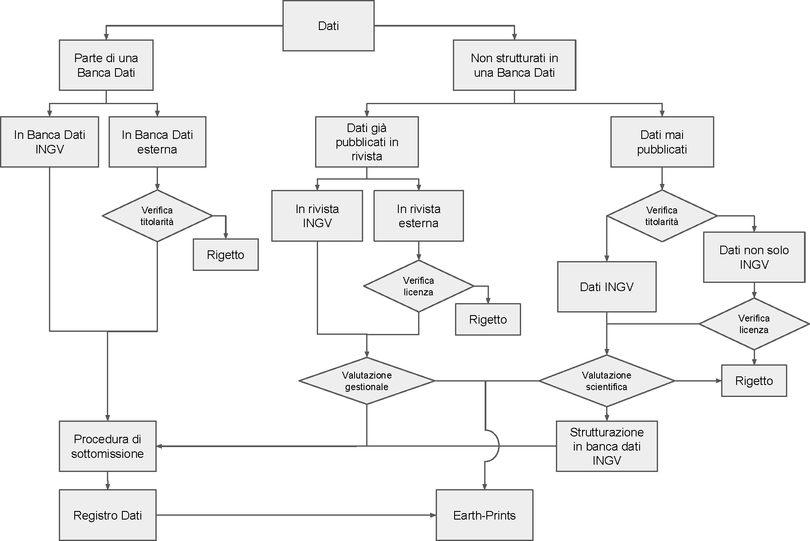

3. Gestione dei Dati 
=====================

Di seguito sono riportate le regole e le procedure adottate dall’INGV
per la gestione dei dati e vengono individuati gli organi istituzionali
che concorrono alla loro gestione.

3.1 Regole di Accesso ai Dati 
------------------------------

Secondo quanto stabilito nel DP200, principio fondamentale per l’INGV è
l’Accesso Aperto all’informazione scientifica, ovvero garantirne
l’accesso senza costi aggiuntivi per l’utente finale, oppure di renderla
disponibile ai costi marginali sostenuti per la riproduzione e
divulgazione [13]_.

Nel rispetto di questo principio valgono le seguenti regole.

Il ***Servizio***, laddove per servizio si intende una qualunque delle
operazioni applicabili ad una banca dati che permetta la ricerca,
visualizzazione, trasferimento, trasformazione, modifica e/o
aggiornamento dei dati, può essere **Aperto** (liberamente disponibile
ed accessibile a chiunque, senza restrizioni) oppure **Limitato**
(disponibile, ma alle condizioni stabilite o concordate dal/col titolare
del diritto di sfruttamento della proprietà intellettuale), in questo
caso la limitazione deve essere definita e motivata. In particolare:

-  il servizio di ricerca dei metadati sarà sempre aperto, ciò allo
       scopo di dare la maggior visibilità possibile ai dati;

-  il servizio di visualizzazione dei dati sarà aperto, laddove le
       infrastrutture informatiche lo rendano possibile;

-  il trasferimento dei dati può subire limitazioni per specifiche
       tipologie di utenti e/o per periodi di tempo definiti;

-  i servizi di analisi e trasformazione dei dati possono essere
       limitati ai soli produttori del dato o a gruppi ristretti di
       utenti adeguatamente definiti;

-  eventuali servizi di modifica e/o aggiornamento dei dati contenuti
       nelle banche dati dovranno essere necessariamente limitati a
       personale autorizzato e protetti con misure di sicurezza adeguate
       al fine di preservarne l’integrità e garantire il totale
       controllo delle modifiche.

Il tipo di accesso al singolo servizio può essere, se necessario,
modificato, previa adeguata e approvata motivazione.

Gli ***Utenti*** sono classificati secondo tre modalità di accesso:
**Anonimo**, **Registrato, Autorizzato**. Nel caso di utenti registrati
e autorizzati, i sistemi di accesso devono svolgere la funzione di
identificazione, autenticazione e autorizzazione all’utilizzo dei
servizi richiesti. In linea generale i dipendenti INGV non dovrebbero
mai avere limitazioni maggiori rispetto agli utenti esterni, ovviamente
nel rispetto di eventuali accordi nel caso in cui siano coinvolti più
istituzioni.

Il mancato rispetto delle regole di accesso da parte degli utenti o di
rispetto delle licenze di utilizzo dei dati, adeguatamente accertato,
sarà contestato agli interessati e, nel caso di autorizzazioni
istituzionali, anche all’ente di appartenenza. L’INGV si riserva di
adottare provvedimenti di limitazione di accesso ai dati nei confronti
di coloro (singoli o enti) che non rispettano le regole di accesso
stabilite nel Registro Dati. Nei casi più gravi, l’INGV si riserva di
adire le vie legali per tutelare la propria proprietà intellettuale o
eventuali danni patrimoniali o di immagine.

Nelle more della realizzazione del portale dati dell’INGV, i siti web
che pubblicano i dati contenuti nel Registro Dati, gestiti dai singoli
produttori o dalle Sezioni, dovranno esplicitare tutte le suddette
informazioni agli utenti. In particolare dovranno essere comunicate agli
utenti:

-  la licenza associata ai dati;

-  le regole di accesso ai dati in una sezione chiamata “Termini di
       utilizzo dei dati”;

-  le “Limitazioni di responsabilità” per informare gli utenti circa il
       livello di attendibilità dei dati così da scaricare eventuali
       responsabilità imputabili all’INGV e agli autori relativamente a
       potenziali danni derivanti da usi impropri dei dati causati da
       terze parti.

3.2 Procedure di Identificazione del Produttore dei Dati 
---------------------------------------------------------

Per quanto attiene al rispetto delle norme che regolamentano la gestione
dei dati della Pubblica Amministrazione e ai fini dell’inserimento dei
dati nel Registro Dati è necessario identificare il Produttore del Dato.
Nel fare ciò è opportuno considerare la tipologia, o classe, del dato.
Per questa prima fase di attuazione della politica dei dati, si adottano
due sole Classi di dati, denominate A e B, in funzione delle
caratteristiche e ruolo del dato in oggetto. In particolare, la Classe A
identifica i dati che hanno uno specifico ruolo rispetto agli impegni
istituzionali e agli obiettivi strategici dell'Ente per come stabiliti
nel PTA. La Classe B identifica tutti gli altri dati. La valutazione
della classe del dato è di competenza dei Direttori di Dipartimento in
quanto soggetti istituzionali con compiti di promozione, programmazione,
coordinamento e verifica, così come indicato nello Statuto
dell’ente [14]_. In particolare ai fini della migrazione dei dati nel
Registro, i dati di Classe A saranno considerati prioritari.

Per quanto concerne l’identificazione del Produttore dei Dati, la
procedura segue quindi percorsi diversi a seconda della classe
attribuita al dato.

Nel caso di dati attribuiti alla Classe A, l’identificazione del
Produttore dei Dati e del suo eventuale Responsabile, seguirà la
procedura "*top-down"* sotto definita.

-  Il/I Direttore/i di Dipartimento definisce il tipo di dato in base
       alla priorità istituzionale e contemporaneamente individua la
       Sezione, o le Sezioni nel caso di più Sezioni coinvolte nella
       produzione del dato, di riferimento.

-  Il/I Direttore/i della/e Sezione/i di riferimento individua il
       personale coinvolto nella raccolta e elaborazione del dato; in
       caso di più unità di personale il/i Direttore/i individua un
       Responsabile.

-  Il/I Direttore/i di Dipartimento/e valida la decisione del/i
       Direttore/i di Sezione/i.

-  Il Responsabile dei Dati avvia la procedura di inserimento dei dati
       nel Registro secondo le modalità indicate dall’Ufficio Gestione
       Dati.

Nel caso di dati attribuiti alla Classe B, l’identificazione del
Produttore dei Dati e del suo eventuale Responsabile, seguirà la
procedura *bottom-up* sotto definita.

-  Il personale coinvolto nella produzione del dato, propone il
       Produttore dei Dati al/i proprio/i Direttore/i di Sezione; in
       caso di più unità di personale, il Produttore dei Dati individua
       autonomamente un Responsabile; nel caso di Produttore dei Dati
       che coinvolgono più Sezioni, il personale coinvolto individua
       autonomamente una Sezione di riferimento, che dovrebbe coincidere
       con quella del Responsabile.

-  Il Direttore della Sezione di riferimento valida la proposta ricevuta
       considerando il contributo del personale proponente alla
       produzione del dato; nel caso di più Sezioni, la decisione è
       presa congiuntamente dai Direttori delle Sezioni coinvolte.

-  Il/i Direttore/i di Dipartimento valida la proposta del Direttore di
       Sezione considerando gli aspetti scientifici e gestionali del
       dato.

-  Nel caso in cui alcuni componenti del Produttore dei Dati afferiscano
       ad altre istituzioni deve esistere un documento formale che
       regoli la co-titolarità dei dati.

-  Il Responsabile dei Dati avvia la procedura di inserimento dei dati
       nel Registro secondo le modalità indicate dall’UGD.

3.3 Procedure di Verifica di Idoneità dei Dati
----------------------------------------------

Una volta definita la sua classe, prima che un dato possa essere
inserito nel Registro, è necessario verificarne l’idoneità. La procedura
per la verifica di tale idoneità è schematizzata in Figura 1. Le
informazioni necessarie alla verifica vengono fornite all’UGD dal
Referente del Produttore dei Dati (vedi Capitolo 4).

Nel caso di Set di Dati non strutturati per cui è richiesta una qualche
valutazione tecnico-scientifica, questa sarà a cura dei Direttori di
Dipartimento e dovrà essere acquisita prima dell’avvio della procedura
di inserimento dei dati nel Registro.

*Figura 1 – Procedura per la verifica di idoneità dei dati ai fini del
loro inserimento nel Registro Dati.*

.. [13]
       D.Lgs. 7 marzo 2005, n. 82. Codice dell'Amministrazione Digitale
       (CAD). art.1, comma 1, lett. l-ter.

.. [14]
       Decreto n.424 del Consiglio di Amministrazione INGV del 15
       settembre 2017, come da Gazzetta Ufficiale n.27 del 2 settembre
       2018.

.. [15]
       OpenAire. Guidelines for Data Archives.

