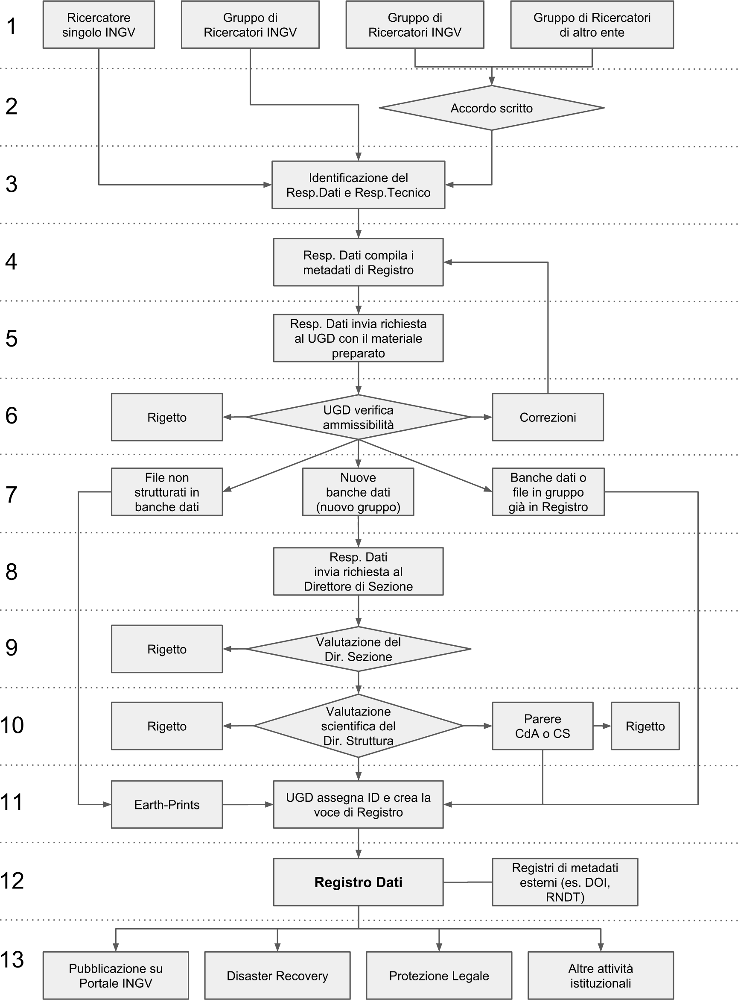

4. Registro Dati
================

La realizzazione del Registro dei Dati è condizione determinante per
l’attuazione della politica dei dati dell’INGV.

Il Registro Dati, elencando l’insieme dei metadati riferiti ai dati
scientifici prodotti dall’INGV, di fatto dota l’INGV di un mezzo per
l’identificazione dei dati istituzionali e di quelli relativi a progetti
e convenzioni o prodotti da terzi. In linea di principio il Registro
Dati contiene dati relativi:

-  alle attività istituzionali, a prescindere se siano strutturati o
       meno in Banche Dati, qualunque tipo di accesso ai servizi
       prevedano;

-  a progetti e convenzioni, ammesso che prevedano un accesso aperto;

-  prodotti da terze parti la cui gestione e/o pubblicazione è stata
       demandata ad INGV grazie ad un accordo formale, ammesso che
       prevedano un accesso aperto.

Il Registro Dati intende migliorare e semplificare l’intero ciclo della
ricerca scientifica ed è pensato per soddisfare le esigenze del
personale INGV a tutti i livelli così come le esigenze di soggetti che
interagiscono o vorrebbero potenzialmente interagire con l’INGV e che
quindi richiedono strumenti semplificati e centralizzati per l’accesso
ai dati.

Il Registro Dati mira a semplificare i sistemi per la valutazione delle
metriche relative all'impatto dei risultati della Ricerca.

Il Registro Dati contribuisce alla semplificazione e verificabilità
delle ipotesi scientifiche in quanto permette di rintracciare
univocamente i dati utilizzati per elaborarle permettendone la
riproducibilità. Sarà inoltre possibile per i ricercatori aggiungere
nelle pubblicazioni dei riferimenti univoci ai dati utilizzati,
favorendo al contempo il riconoscimento del lavoro svolto dalle persone
che quei dati hanno contribuito a creare.

Il Registro Dati è aperto e reso accessibile tramite il Portale Web
dell’INGV. Ai fini della gestione e fruizione del Registro Dati, è
necessario raccogliere e mantenere aggiornati i metadati di ciascun
elemento. La gestione scientifica, tecnica e amministrativa del Registro
è affidata al Gruppo Gestione Registro Dati.

Le voci di Registro sono organizzate in gruppi di dati riconducibili a
una comune tipologia di oggetti, ad esempio versioni successive di un
prodotto scientifico oppure sottoprodotti o sottoinsiemi di dati
generati o semplicemente contenuti in una stessa Banca Dati. Ciascun
gruppo di elementi può essere a sua volta collegato ad altri gruppi,
adottando le tipologie di relazioni suggerite nelle linee guida
OpenAire [15]_.

4.1 Metadati
------------

Di seguito è presentato l’elenco dei metadati necessari a descrivere
ciascun elemento del Registro Dati (Tabella 1). È prevedibile che questo
elenco possa essere integrato alla luce di esigenze istituzionali o
future indicazioni dell’Agenzia Digitale per l’Italia [16]_, tali
eventuali integrazioni verranno effettuate dall’UGD e verranno
opportunamente comunicate al personale e comunque rese disponibili sul
sito Web del Gruppo Gestione Registro Dati.

*Tabella 1. Metadati che descrivono ciascun elemento inserito nel

| Metadato 	| Descrizione del metadato 	|
|-----------------------------------------	|------------------------------------------------------------------------------------------------------------------------------------------------------------------------------------------------------------------------------------------------------------------------------------------------------------------------------------------------------------------------------------------------------------------------------------------------------------------------------------------------------------------------------------------------------------------------------------------------------------------------------------------------------------------------------------------------------------------------------------------------------------------------------------------------------------------------------------------------------------------------------------------------------------------------------------------------------------------------------------------------------------------------------------------------------------------------------------------------------------------------------------------------------------------------------------------------------------------------------------------------------------------------------------	|
| ID 	| Identificativo del record. 	|
| ID Gruppo 	| Identificativo del gruppo di elementi. 	|
| Gruppo 	| Nome per esteso del gruppo di elementi. 	|
| Acronimo Gruppo 	| Eventuale acronimo associato al gruppo. 	|
| Nome 	| Nome per esteso dell’elemento. 	|
| Acronimo 	| Eventuale acronimo associato all’elemento. 	|
| Tipo di Elemento 	| Tipologia di elemento (es.: “Banca dati digitale”, “Dati digitali non strutturati in banca dati”, “Campioni fisici”). 	|
| Descrizione 	| Breve descrizione dell’elemento. 	|
| Identificativi Persistenti 	| Identificativi persistenti associati all’elemento. 	|
| Classe 	| Dati Vulcanologici Dati Geochimici (analisi geochimiche di rocce, acque e gas) Dati Geodetici Dati Sismologici e Infrasonici (terrestri e marini) Dati di campioni fisici (campioni e parametri fisici di rocce, minerali e materiali vari) Dati di Geofisica atmosferica e Aeronomia Dati Geologici (terrestri e marini) Dati Geofisici (geomagnetici, geoelettrici, EM, etc.) terrestri e marini Dati da Modelli Numerici Dati di Telerilevamento 	|
| Livello 	| Livello 0: dati grezzi (Level 0 raw data) o di base, che non hanno subito alcun livello di elaborazione, esclusa, al più, una validazione di tipo automatico (esempi: forme d’onda, dati GPS, immagini non calibrate, campioni di roccia). Livello 1: prodotti (Level 1 data products) ottenuti da procedure automatiche o semi-automatiche (esempi: localizzazione, magnitudo, meccanismi focali dei terremoti, shakemaps, serie storiche dell’ampiezza del tremore vulcanico, dello spostamento di stazioni GPS). Livello 2: prodotti (Level 2 data products) ottenuti dall’attività di ricerca e comunque sulla base di procedure non automatiche (esempi: modelli crostali, mappe di strain, modelli di sorgente dei terremoti o delle deformazioni, modelli di simulazione numerica dei processi vulcanici, risultati di campagne geofisiche, misure di laboratorio su campioni prelevati per finalità scientifiche). Livello 3: prodotti integrati (Level 3 integrated data products) ottenuti da analisi complesse che integrano più prodotti di Livello 2 oppure da analisi che integrano prodotti di Livello 1 o 2 di diverse tipologie e/o provenienti da diverse comunità (esempi:  mappe di pericolosità, cataloghi di faglie attive, rapporti di attività vulcanica). 	|
| Copertura Geografica 	| Si può indicare in modo testuale (esempi: Mondo; Europa; Italia; Etna; provincia di Catania) oppure con le coordinate dei vertici che rappresentano il poligono di copertura geografica codificate con lo standard WKT. 	|
| Formati di codifica dei dati 	| Possibilmente indicando un riferimento allo standard per i formati meno diffusi. 	|
| Metadati associati 	| Se viene adottato un modello di metadati per la descrizione della risorsa nel suo complesso e/o del suo contenuto indicare quale (esempi: Dublin Core, DCAT, DataCite, RNDT, INSPIRE). Indicare "custom" se si tratta di metadati codificati secondo uno standard interno non largamente diffuso. 	|
| Tipologia di dati 	| Dati dinamici o dati statici. 	|
| Frequenza di aggiornamento 	| Nel caso si tratti di dati dinamici, qui si specifica la frequenza con cui il contenuto viene modificato (es.: registrati in continuo “data streaming”), indipendentemente dal motivo che porta alla modifica. 	|
| Finalità di utilizzo 	| Diverse casistiche e contesti di utilizzo dei dati (esempi: emergenza, comunicazione, formazione, usi commerciali). 	|
| Responsabile dei Dati 	| Dipendente INGV di riferimento che cura gli aspetti scientifici e amministrativi relativi ai dati. Oltre a nome, cognome e affiliazione, deve essere presente il codice ORCID. 	|
| Responsabile Tecnico 	| Dipendente INGV di riferimento che cura gli aspetti tecnologici relativi alla Banca Dati. Oltre a nome, cognome e affiliazione, deve essere presente il codice ORCID. 	|
| Produttore dei Dati 	| Singolo dipendente o gruppo di dipendenti INGV che produce i dati. Per ciascun dipendente deve essere indicato nome, cognome, affiliazione, definito il ruolo, possibilmente espresso secondo le specifiche OpenAire e fornito il codice ORCID. 	|
| Organizzazione della banca dati 	| Tipologia di organizzazione dell’archiviazione dei dati (esempi: rete di monitoraggio, banca dati, dati grezzi su filesystem o cloud, archivio documentale, archivio di campioni fisici, archivio fotografico). 	|
| Sezioni INGV coinvolte 	| Elenco delle Sezioni e sedi coinvolte nella creazione dei dati e nella loro gestione (esempi: ONT, RM1, RM2, OV, OE, PA, BO, PI, MI). 	|
| URLs 	| Indirizzo/i Web come l’homepage (Landing page), o pagine relative ai servizi quali la ricerca di dati, la visualizzazione, il trasferimento, la trasformazione, la modifica e/o aggiornamento dei dati. 	|
| Web Service 	| Indicazione di eventuali modalità di accesso ai dati tramite Web service o API (Application Programming Interface) o altre procedure automatizzabili con l’indicazione dello standard adottato (esempi: RESTful, SOAP, CGI). Se disponibile, indicare l’indirizzo Web da cui è possibile accedere. 	|
| Documentazione 	| Link alla documentazione di riferimento, sia di natura scientifica, sia tecnologica. Se disponibile, compilare con il DOI delle pubblicazioni, altrimenti con URL. 	|
| Citazione 	| Citazione bibliografica dei dati. 	|
| Parole chiave 	| Elenco di parole chiave che identificano i dati. Obbligatoria la compilazione di un elenco in lingua inglese, facoltativa l’aggiunta di un elenco in lingua italiana. 	|
| Stato 	| Valori ammessi: “in progettazione”, “in sviluppo”, “operativo”. Indicare “legacy” per dati o prodotti non più gestiti né aggiornati, ma comunque ancora accessibili. 	|
| Titolarità 	| La titolarità è dell’INGV, salvo nei casi in cui siano coinvolte altre istituzioni. 	|
| Licenza 	| Tipologia di licenza Creative Commons associata ai dati e/o alla banca dati, poiché potrebbero differire (licenza associata al contenitore diversa dalla licenza associata al/ai contenuto/i). 	|
| Accesso ai dati 	| I valori ammessi sono “anonimo”, “registrato”, “autorizzato”. Se non applicabile, descrivere brevemente eventuali termini di accesso alternativi. 	|
| Classe Open Data 	| Classe secondo la classificazione "5 stars" che definisce la tipologia di Open Data. 	|
| Classe metadati 	| Classe secondo la classificazione dei metadati proposta dall'Agenzia per l'Italia Digitale ("Livelli del modello per i metadati" da "Linee Guida Nazionali per la Valorizzazione del Patrimonio Informativo Pubblico 2016"). 	|
| RNDT 	| Indicazione della rilevanza dei dati ai fini del Repertorio Nazionale dei Dati Territoriali. 	|
| Progetti/ iniziative di riferimento 	| Progetto/i e/o iniziativa/e di riferimento per il dato e/o prodotto indicato (esempi: Convenzione INGV-DPC, H2020 –seguito dal nome del progetto-, EPOS, EMSO, MED-SUV). 	|
| Altre istituzioni coinvolte 	| Nel caso in cui altre istituzioni oltre a INGV abbiano contribuito alla creazione dei dati, indicare quali, specificando per ciascuna il livello di contributo (esempi: trascurabile, marginale, sostanziale). 	|
| Collegamenti 	| E’ possibile indicare collegamenti e la tipologia di relazione secondo le linee guida OpenAire. E’ possibile stabilire collegamenti ad altri elementi di Registro oppure a elementi esterni al Registro come ad esempio pubblicazioni, o altre Banche Dati che rendono disponibili gli stessi dati. 	|
| Data di creazione dei dati 	| Data in cui i Dati sono stati creati. 	|
| Data di creazione del record 	| Data in cui l’elemento è stato inserito nel Registro Dati. 	|
| Data di ultimo aggiornamento del record 	| Data di ultimo aggiornamento delle informazioni relative all’elemento. 	|
| Note 	| Eventuali note aggiuntive utili ai fini del Registro Dati. 	|

4.2 Gestione Ordinaria del Registro Dati
----------------------------------------

La gestione ordinaria del Registro Dati coinvolge, a diverso livello, i
seguenti soggetti istituzionali:

-  Il Responsabile dei Dati e il Responsabile Tecnico della Banca Dati,
       che agisce per conto del Produttore di Dati;

-  Il Direttore di Sezione cui fa riferimento il Responsabile dei Dati;

-  Il Direttore di Dipartimento, responsabile della validazione
       istituzionale e della qualità scientifica; nel caso in cui il
       dato coinvolga più Dipartimenti, i Direttori di Dipartimento, ne
       identificano uno di riferimento;

-  L’Ufficio Gestione Dati (UGD), che coordina e gestisce l'intero iter
       procedurale.

4.2.1 Criteri di ammissibilità
~~~~~~~~~~~~~~~~~~~~~~~~~~~~~~

Ai fini del loro inserimento nel Registro Dati, i dati devono rispettare
alcuni criteri di ammissibilità.

In linea di principio, sono inseriti tutti i dati relativi ad attività
istituzionali, qualunque tipo di accesso ai servizi prevedano; i dati
relativi a progetti e convenzioni e quelli prodotti da terze parti la
cui gestione e/o pubblicazione è stata demandata ad INGV, sono inseriti
solo se prevedono un accesso aperto.

I dati devono essere frutto del lavoro di personale dell'INGV ovvero del
lavoro congiunto di personale INGV e di altro ente o istituzione, o
essere dati prodotti da altre istituzioni che demandino all’INGV il
ruolo di renderli accessibili; nel caso in cui siano coinvolte a vario
titolo altre istituzioni devono essere soddisfatte due condizioni:

-  il personale dipendente INGV deve avere contribuito non marginalmente
       alla creazione dei dati ovvero si occupa della gestione e/o
       pubblicazione dei dati;

-  l’INGV, al fine di prevenire possibili situazioni di contenzioso,
       deve dotarsi di accordi formali scritti, approvati dagli Organi
       competenti degli altri enti o istituzioni che disciplinino e
       riportino chiaramente i termini stabiliti tra le parti e,
       soprattutto, l'espressa accettazione dell'inserimento di questi
       dati nel Registro Dati dell’INGV; si precisa che tale
       documentazione deve essere sottoscritta dai soggetti legittimati,
       che dispongano cioè della titolarità dei dati oggetto
       dell’accordo.

I dati devono essere accessibili tramite Internet; nel caso di dati
fisici (ad esempio campioni di roccia), devono essere accessibili i
metadati e stabiliti i termini di accesso all’oggetto fisico.

Per ciascun dato deve essere specificata la tipologia di servizio e le
relative regole di accesso, secondo quanto stabilito nei Principi della
Politica dei Dati. Nel caso di Accesso Registrato o Autorizzato, devono
essere definiti e motivati i criteri. In caso di eventuali limitazioni
nei Servizi di Accesso, come nel caso di embargo, queste devono essere
specificate e adeguatamente motivate. In mancanza di queste specifiche e
motivazioni, il servizio di accesso sarà considerato aperto.

Devono essere disponibili i metadati previsti dal Registro Dati.

Deve essere inoltre disponibile una descrizione che illustri l'iter di
generazione dei dati, in cui sia segnalata l’eventuale provenienza di
dati di cui l’INGV non è l’unico titolare.

Per i dati classificati come statici, deve essere garantita l’integrità
e l’invariabilità nel tempo così come quando inseriti nel Registro,
anche attraverso l’utilizzo di strumenti informatici di validazione (es.
*hashing*, metodo per creare e confrontare chiavi crittografate).
Qualora si manifesti la necessità di variare un dato, si creerà un nuovo
elemento associato alla nuova versione del dato; a questo nuovo elemento
verrà assegnato un nuovo identificativo di Registro e, se presente nella
versione precedente, anche un nuovo DOI. E’ importante che una volta che
un elemento sia inserito nel Registro Dati, esso debba essere mantenuto
accessibile nel tempo, anche se versioni successive più evolute dello
stesso sono nel frattempo subentrate.

Devono essere rispettati gli standard d’interoperabilità sia per la
codifica dei dati, sia negli eventuali servizi di accesso ai dati,
indicando se coincidano con quelli suggeriti dall'Agenzia per l'Italia
Digitale [21]_, oppure se si tratta di standard di riferimento nel
settore scientifico di riferimento.

Deve essere data segnalazione se si tratti di dati territoriali che
possano essere iscritti nel Repertorio Nazionale dei Dati Territoriali
(RNDT) [22]_, con particolare riferimento ai dati territoriali definiti
da normativa di “interesse generale” [23]_.

Ogni richiesta di inserimento dati deve essere corredata da un piano di
sostenibilità concordato con i Direttori delle Sezioni coinvolte, che
chiarisca la natura e la durata della copertura finanziaria necessaria
all'infrastruttura che ospita i dati e che descriva se e come le
soluzioni adottate garantiscono sia la conservazione sia l'accessibilità
ai dati nel lungo periodo.

4.2.2 Procedura di inserimento di elementi 
~~~~~~~~~~~~~~~~~~~~~~~~~~~~~~~~~~~~~~~~~~~

La procedura ordinaria di sottomissione si compone dei seguenti passaggi
(Figura 2):

1. Si formalizza l’identità del Produttore dei Dati (vedi Capitolo 3.2)
   indicando per ciascun componente l'afferenza, il ruolo, e il codice
   identificativo ORCID, come da indicazioni MIUR [24]_ e ANVUR [25]_.

2. Nel caso in cui alcune persone afferiscano ad altre istituzioni, è
   necessario assicurarsi che esista un documento formale che regoli i
   termini della collaborazione e dello scambio di dati che deve
   espressamente prevedere che l’INGV la facoltà di poter ripubblicare i
   dati e di inserirli nel proprio Registro Dati;

3. Il Produttore di Dati indica il Responsabile dei Dati e, nel caso di
   una Banca Dati, il Responsabile Tecnico della Banca Dati;

4. Il Responsabile dei Dati verifica i criteri di ammissibilità compila
   i metadati, nel caso in cui sia possibile, compila anche i metadati
   associati all’identificativo DOI (Capitolo 5.2) e per i dati di
   Livello 3 e 4 propone una delle licenze *Creative Commons* (paragrafo
   4.2.5);

5. Il Responsabile dei Dati sottomette la richiesta via e-mail all’UGD
   allegando il materiale preparato al punto precedente;

6. L’UGD verifica l'ammissibilità tecnica della richiesta e valida i
   metadati, interagendo se necessario con il Responsabile dei Dati per
   eventuali correzioni;

7. L’UGD identifica la tipologia di dati oggetto della richiesta e ne
   stabilisce il successivo iter che può essere di due tipi: completo,
   che si adotta per le Banche Dati nuove che non sono parte di gruppi
   di dati già presenti nel Registro, o semplificato, che si adotta per
   i singoli file o Banche Dati che sono parte di un gruppo di dati già
   presente nel Registro (es.: una nuova versione, o un sottoinsieme).
   Viene inviata notifica al Responsabile dei Dati dell'avvenuta
   accettazione preliminare; in caso di rigetto della richiesta, verrà
   inviata una e-mail al Responsabile dei Dati con le ragioni della
   inammissibilità;

8. Il Responsabile dei Dati sottomette al Direttore di Sezione una
   richiesta scritta per l’inserimento dei dati nel Registro, allegando
   il nulla osta dell’UGD, i metadati e l'eventuale documentazione
   necessaria (esempio: accordi formali per lo scambio dei dati con
   altre istituzioni).

9. Il Direttore di Sezione verifica l’attendibilità della richiesta
   sottomessa e la trasmette al Direttore di Dipartimento;

|Regolamento DOI|

*Fig.2 - Schema a blocchi della procedura per l’inserimento di nuovi
elementi nel Registro Dati.*

1. Il Direttore di Dipartimento valuta la richiesta, anche in relazione
   al Programma Triennale di Attività dell’INGV; nel caso di dati di
   Livello 0 o 1, assegna la licenza d’uso in qualità di delegato del
   legale rappresentante dell’INGV; invia l’autorizzazione a procedere
   all’UGD;

2. L’UGD procede all'assegnazione dell'identificativo di Registro e
   inserisce il nuovo elemento nel Registro Dati; nel caso in cui i dati
   non siano né strutturati né strutturabili in una Banca dati
   istituzionale esistente, essi vengono archiviati in Earth-Prints;

3. L’UGD inserisce i metadati dell’elemento in Registri di metadati
   esterni, in particolare nel Registro DOI di DataCite e, nel caso in
   cui sia data segnalazione dal Responsabile dei Dati che i dati siano
   di tipo territoriale e siano di interesse per il Repertorio Nazionale
   dei Dati Territoriali (RNDT), inserisce i dati nel Registro RNDT;

4. L’UGD procede ad aggiornare le informazioni del Registro Dati sul
   portale istituzionale dell’INGV.

4.2.3 Modifiche e integrazioni a elementi
~~~~~~~~~~~~~~~~~~~~~~~~~~~~~~~~~~~~~~~~~

Eventuali richieste di modifiche ai metadati associati agli elementi già
presenti nel Registro Dati vanno comunicate dal Responsabile dei Dati
all’UGD che ne valuterà l’ammissibilità, basandosi sulla consistenza
rispetto a quanto già presente nel Registro. Se l’entità delle
variazioni sarà giudicata rilevante, si valuterà la creazione di un
nuovo elemento nel Registro Dati, ripercorrendo in parte o tutta la
procedura di sottomissione. Sarà cura dell’UGD tenere traccia di tutte
le modifiche effettuate su ciascun elemento del Registro Dati.
Periodicamente, l’UGD verificherà l’accessibilità, integrità e coerenza
dei dati presenti nel Registro Dati; nel caso in cui vengano riscontrate
incongruenze, l’UGD interagirà con il Responsabile dei Dati per le
opportune azioni.

4.2.4 Rimozione di elementi
~~~~~~~~~~~~~~~~~~~~~~~~~~~

La rimozione di un elemento dal Registro Dati può avvenire dietro
presentazione di motivata richiesta da parte del Responsabile dei Dati
all’UGD che ne valuterà l’ammissibilità. Nel caso in cui venga approvata
la richiesta, l’elemento non scomparirà dal Registro Dati, ma verrà
indicato, insieme al motivo della rimozione, come elemento rimosso.
Eventuali identificativi persistenti (es.: DOI) non saranno rimossi, ma
si procederà a modificare opportunamente i relativi metadati per
segnalare che si tratta di elementi rimossi. Verrà inoltre richiesto al
Responsabile dei Dati la creazione di una *Landing Page* in cui sia
spiegata la motivazione della rimozione e che presenti, se esistente, un
collegamento all’elemento che sostituisce quello rimosso.

4.2.5 Licenze associate agli elementi
~~~~~~~~~~~~~~~~~~~~~~~~~~~~~~~~~~~~~

Poiché la normativa vigente adotta il principio *open by
default*\  [26]_ secondo cui *“I dati [...] che le amministrazioni
pubblicano, con qualsiasi modalità, senza l'espressa adozione di una
licenza [...] si intendono rilasciati come dati di tipo aperto”*, INGV,
in quanto titolare, apporrà una licenza [27]_ ad ogni elemento del
Registro Dati [28]_. In accordo con quanto stabilito nei Principi della
Politica dei Dati dell’INGV e con quanto suggerito dalle linee guida
della Commissione Europea [29]_, le licenze adottate saranno di tipo
*Creative Commons*\  [30]_.

Ai fini di supportare l’\ *Open Science* tramite la pubblicazione di
“Dati di tipo aperto” [31]_, si stabilisce che ai dati di Livello 0 e 1
sia attribuita la licenza *“Creative Commons Attribution (CC
BY)”*\  [32]_, in forza del principio sancito nei “Principi della
Politica dei Dati dell’INGV” secondo cui il titolare  [33]_ della
proprietà intellettuale di questi dati è l’INGV. Per quanto riguarda la
versione della licenza, al momento della redazione di questo documento
si fa riferimento alla v4.0 ma successivamente si dovranno tenere in
considerazione gli eventuali aggiornamenti [34]_.

Per i dati di Livello 2 e 3, il Responsabile dei Dati può suggerire,
tenendo conto della normativa vigente, una delle licenze *Creative
Commons* al momento della richiesta all’UGD che si occuperà di vagliarne
l’ammissibilità. Nel caso in cui il Responsabile dei Dati proponga una
licenza diversa dalla *CC BY*, dovrà fornire la motivazione della
proposta, al fine di indirizzare l’UGD nel processo di valutazione di
ammissibilità. Nel caso in cui nessuna licenza venga proposta dal
Responsabile dei Dati, verrà attribuita automaticamente la licenza *CC
BY*. La licenza assegnata dovrà essere riportata nella *Landing Page*
del sito dal quale vengono distribuiti i dati, le cui caratteristiche
sono dettagliate al punto 5.2.

4.2.6 Identificativi persistenti associati agli elementi
~~~~~~~~~~~~~~~~~~~~~~~~~~~~~~~~~~~~~~~~~~~~~~~~~~~~~~~~

I dati inseriti nel Registro avranno, oltre a un identificativo di
Registro, anche un identificativo persistente largamente adottato in
ambiente scientifico come il codice DOI. L’Agenzia di Registro DOI
utilizzata è DataCite, di cui si adotta il relativo schema di
metadati [35]_. Per dettagli sulla procedura di assegnazione di questo
identificativo, si fa riferimento al Capitolo 5 “Registri di metadati
non gestiti da INGV”.

4.2.7 Esclusione di responsabilità e termini di utilizzo dei dati
~~~~~~~~~~~~~~~~~~~~~~~~~~~~~~~~~~~~~~~~~~~~~~~~~~~~~~~~~~~~~~~~~

L’UGD di concerto con il settore Affari Legali e Contenzioso stabilirà
caso per caso le modalità ed azioni per la gestione dell’esclusione di
responsabilità dell’INGV e del personale circa l'eventuale incompletezza
ed incertezza dei dati presenti nel Registro Dati, utilizzo, anche
parziale, dei dati riportati nel Registro Dati da parte di terzi e
eventuali danni arrecati a terzi derivanti dal loro utilizzo.

.. [15]
       OpenAire. Guidelines for Data Archives.

.. [16]
       Agenzia Digitale per l’Italia. Linee Guida per i cataloghi dati.

.. [17]
       Well-known text, ISO/IEC 13249-3:2016,
       https://en.wikipedia.org/wiki/Well-known\_text

.. [18]
       OpenAire. OpenAIRE Guidelines for Data Archives.

.. [19]
       5 stars Open Data. http://5stardata.info

.. [20]
       OpenAire. Guidelines for Data Archives.

.. [21]
       Agenzia Digitale per l'Italia (2017). Linee Guida Nazionali per
       la Valorizzazione del Patrimonio Informativo Pubblico.

.. [22]
       D.Lgs. 7 marzo 2005, n. 82. Codice dell'Amministrazione Digitale
       (CAD). Art. 59, Comma 5.

.. [23]
       Decreto della Presidenza del Consiglio dei Ministri 10 novembre
       2011. Art.3, Comma 1. Elenco in Allegato 1.

.. [24]
       Decreto del Ministero dell'Istruzione, dell'Università e della
       Ricerca del 7 giugno 2016, n. 120.

.. [25]
       ANVUR, Progetto IRIDE.

.. [26]
       D.Lgs. 7 marzo 2005 n. 82. Codice dell'amministrazione digitale
       (CAD). Art.52, comma 2.

.. [27]
       D.Lgs. 24 gennaio 2006, n.36. Art.5, Comma 1, *“[…] Il titolare
       del dato adotta prioritariamente licenze aperte standard […]”*.
       Art.2, Comma h, *"licenza standard per il riutilizzo: il
       contratto, o altro strumento negoziale, redatto ove possibile in
       forma elettronica, nel quale sono definite le modalità di
       riutilizzo dei documenti delle pubbliche amministrazioni o degli
       organismi di diritto pubblico"*.

.. [28]
       D.Lgs. 30 marzo 2001 n. 165, comma 2. I soggetti titolati
       all’apposizione di licenze ai dati sono le amministrazioni
       pubbliche, intese come *“tutte le amministrazioni dello Stato,
       ivi compresi gli istituti e scuole di ogni ordine e grado e le
       istituzioni educative, le aziende ed amministrazioni dello Stato
       ad ordinamento autonomo, le Regioni, le Province, i Comuni, le
       Comunità montane e loro consorzi e associazioni, le istituzioni
       universitarie, gli Istituti autonomi case popolari, le Camere di
       commercio, industria, artigianato e agricoltura e loro
       associazioni, tutti gli enti pubblici non economici nazionali,
       regionali e locali, le amministrazioni, le aziende e gli enti del
       Servizio sanitario nazionale l'Agenzia per la rappresentanza
       negoziale delle pubbliche amministrazioni (ARAN) e le Agenzie di
       cui al decreto legislativo 30 luglio 1999, n. 300. Fino alla
       revisione organica della disciplina di settore, le disposizioni
       di cui al presente decreto continuano ad applicarsi anche al
       CONI”*.

.. [29]
       European Commission notice (2014/C 240/01). Guidelines on
       recommended standard licences, datasets and charging for the
       reuse of documents.

.. [30]
       Creative Commons. https://creativecommons.org/

.. [31]
       D.Lgs. 7 marzo 2005 n. 8, Art.68, comma 3, lettera b

.. [32]
       Creative Commons Attribution 4.0 International (CC BY 4.0).
       https://creativecommons.org/licenses/by/4.0/

.. [33]
       D.Lgs. 7 marzo 2005 n. 82, Art. 1, comma cc, così come modificato
       dal D.Lgs. 26 agosto 2016 n. 179, Art.1, comma g

.. [34]
       Creative Commons Licenses.
       https://wiki.creativecommons.org/wiki/License\_Versions

.. [35]
       Datacite. Metadata Schema. https://schema.datacite.org/
                                                                                                                                                                                                                                                                                                                                                                                                                                                                                                                                                                                                                                                                                                                                                                                                                                                       |
| Produttore dei Dati                     | Singolo dipendente o gruppo di dipendenti INGV che produce i dati. Per ciascun dipendente deve essere indicato nome, cognome, affiliazione, definito il ruolo, possibilmente espresso secondo le specifiche OpenAire e fornito il codice ORCID.                                                                                                                                                                                                                                                                                                                                                                                                                                                                                                                                                                                                                                                                                                                                                                                                                                                                                                                                                                                                                                    |
| Organizzazione della banca dati         | Tipologia di organizzazione dell’archiviazione dei dati (esempi: rete di monitoraggio, banca dati, dati grezzi su filesystem o cloud, archivio documentale, archivio di campioni fisici, archivio fotografico).                                                                                                                                                                                                                                                                                                                                                                                                                                                                                                                                                                                                                                                                                                                                                                                                                                                                                                                                                                                                                                                                    |
| Sezioni INGV coinvolte                  | Elenco delle Sezioni e sedi coinvolte nella creazione dei dati e nella loro gestione (esempi: ONT, RM1, RM2, OV, OE, PA, BO, PI, MI).                                                                                                                                                                                                                                                                                                                                                                                                                                                                                                                                                                                                                                                                                                                                                                                                                                                                                                                                                                                                                                                                                                                                              |
| URLs                                    | Indirizzo/i Web come l’homepage (Landing page), o pagine relative ai servizi quali la ricerca di dati, la visualizzazione, il trasferimento, la trasformazione, la modifica e/o aggiornamento dei dati.                                                                                                                                                                                                                                                                                                                                                                                                                                                                                                                                                                                                                                                                                                                                                                                                                                                                                                                                                                                                                                                                            |
| Web Service                             | Indicazione di eventuali modalità di accesso ai dati tramite Web service o API (Application Programming Interface) o altre procedure automatizzabili con l’indicazione dello standard adottato (esempi: RESTful, SOAP, CGI). Se disponibile, indicare l’indirizzo Web da cui è possibile accedere.                                                                                                                                                                                                                                                                                                                                                                                                                                                                                                                                                                                                                                                                                                                                                                                                                                                                                                                                                                                 |
| Documentazione                          | Link alla documentazione di riferimento, sia di natura scientifica, sia tecnologica. Se disponibile, compilare con il DOI delle pubblicazioni, altrimenti con URL.                                                                                                                                                                                                                                                                                                                                                                                                                                                                                                                                                                                                                                                                                                                                                                                                                                                                                                                                                                                                                                                                                                                 |
| Citazione                               | Citazione bibliografica dei dati.                                                                                                                                                                                                                                                                                                                                                                                                                                                                                                                                                                                                                                                                                                                                                                                                                                                                                                                                                                                                                                                                                                                                                                                                                                                  |
| Parole chiave                           | Elenco di parole chiave che identificano i dati. Obbligatoria la compilazione di un elenco in lingua inglese, facoltativa l’aggiunta di un elenco in lingua italiana.                                                                                                                                                                                                                                                                                                                                                                                                                                                                                                                                                                                                                                                                                                                                                                                                                                                                                                                                                                                                                                                                                                              |
| Stato                                   | Valori ammessi: “in progettazione”, “in sviluppo”, “operativo”. Indicare “legacy” per dati o prodotti non più gestiti né aggiornati, ma comunque ancora accessibili.                                                                                                                                                                                                                                                                                                                                                                                                                                                                                                                                                                                                                                                                                                                                                                                                                                                                                                                                                                                                                                                                                                               |
| Titolarità                              | La titolarità è dell’INGV, salvo nei casi in cui siano coinvolte altre istituzioni.                                                                                                                                                                                                                                                                                                                                                                                                                                                                                                                                                                                                                                                                                                                                                                                                                                                                                                                                                                                                                                                                                                                                                                                                |
| Licenza                                 | Tipologia di licenza Creative Commons associata ai dati e/o alla banca dati, poiché potrebbero differire (licenza associata al contenitore diversa dalla licenza associata al/ai contenuto/i).                                                                                                                                                                                                                                                                                                                                                                                                                                                                                                                                                                                                                                                                                                                                                                                                                                                                                                                                                                                                                                                                                     |
| Accesso ai dati                         | I valori ammessi sono “anonimo”, “registrato”, “autorizzato”. Se non applicabile, descrivere brevemente eventuali termini di accesso alternativi.                                                                                                                                                                                                                                                                                                                                                                                                                                                                                                                                                                                                                                                                                                                                                                                                                                                                                                                                                                                                                                                                                                                                  |
| Classe Open Data                        | Classe secondo la classificazione "5 stars" che definisce la tipologia di Open Data.                                                                                                                                                                                                                                                                                                                                                                                                                                                                                                                                                                                                                                                                                                                                                                                                                                                                                                                                                                                                                                                                                                                                                                                               |
| Classe metadati                         | Classe secondo la classificazione dei metadati proposta dall'Agenzia per l'Italia Digitale ("Livelli del modello per i metadati" da "Linee Guida Nazionali per la Valorizzazione del Patrimonio Informativo Pubblico 2016").                                                                                                                                                                                                                                                                                                                                                                                                                                                                                                                                                                                                                                                                                                                                                                                                                                                                                                                                                                                                                                                       |
| RNDT                                    | Indicazione della rilevanza dei dati ai fini del Repertorio Nazionale dei Dati Territoriali.                                                                                                                                                                                                                                                                                                                                                                                                                                                                                                                                                                                                                                                                                                                                                                                                                                                                                                                                                                                                                                                                                                                                                                                       |
| Progetti/ iniziative di riferimento     | Progetto/i e/o iniziativa/e di riferimento per il dato e/o prodotto indicato (esempi: Convenzione INGV-DPC, H2020 –seguito dal nome del progetto-, EPOS, EMSO, MED-SUV).                                                                                                                                                                                                                                                                                                                                                                                                                                                                                                                                                                                                                                                                                                                                                                                                                                                                                                                                                                                                                                                                                                           |
| Altre istituzioni coinvolte             | Nel caso in cui altre istituzioni oltre a INGV abbiano contribuito alla creazione dei dati, indicare quali, specificando per ciascuna il livello di contributo (esempi: trascurabile, marginale, sostanziale).                                                                                                                                                                                                                                                                                                                                                                                                                                                                                                                                                                                                                                                                                                                                                                                                                                                                                                                                                                                                                                                                     |
| Collegamenti                            | E’ possibile indicare collegamenti e la tipologia di relazione secondo le linee guida OpenAire. E’ possibile stabilire collegamenti ad altri elementi di Registro oppure a elementi esterni al Registro come ad esempio pubblicazioni, o altre Banche Dati che rendono disponibili gli stessi dati.                                                                                                                                                                                                                                                                                                                                                                                                                                                                                                                                                                                                                                                                                                                                                                                                                                                                                                                                                                                |
| Data di creazione dei dati              | Data in cui i Dati sono stati creati.                                                                                                                                                                                                                                                                                                                                                                                                                                                                                                                                                                                                                                                                                                                                                                                                                                                                                                                                                                                                                                                                                                                                                                                                                                              |
| Data di creazione del record            | Data in cui l’elemento è stato inserito nel Registro Dati.                                                                                                                                                                                                                                                                                                                                                                                                                                                                                                                                                                                                                                                                                                                                                                                                                                                                                                                                                                                                                                                                                                                                                                                                                         |
| Data di ultimo aggiornamento del record | Data di ultimo aggiornamento delle informazioni relative all’elemento.                                                                                                                                                                                                                                                                                                                                                                                                                                                                                                                                                                                                                                                                                                                                                                                                                                                                                                                                                                                                                                                                                                                                                                                                             |
| Note                                    | Eventuali note aggiuntive utili ai fini del Registro Dati.                                                                                                                                                                                                                                                                                                                                                                                                                                                                                                                                                                                                                                                                                                                                                                                                                                                                                                                                                                                                                                                                                                                                                                                                                         |

4.2 Gestione Ordinaria del Registro Dati
----------------------------------------

La gestione ordinaria del Registro Dati coinvolge, a diverso livello, i
seguenti soggetti istituzionali:

-  Il Responsabile dei Dati e il Responsabile Tecnico della Banca Dati,
       che agisce per conto del Produttore di Dati;

-  Il Direttore di Sezione cui fa riferimento il Responsabile dei Dati;

-  Il Direttore di Dipartimento, responsabile della validazione
       istituzionale e della qualità scientifica; nel caso in cui il
       dato coinvolga più Dipartimenti, i Direttori di Dipartimento, ne
       identificano uno di riferimento;

-  L’Ufficio Gestione Dati (UGD), che coordina e gestisce l'intero iter
       procedurale.

4.2.1 Criteri di ammissibilità
~~~~~~~~~~~~~~~~~~~~~~~~~~~~~~

Ai fini del loro inserimento nel Registro Dati, i dati devono rispettare
alcuni criteri di ammissibilità.

In linea di principio, sono inseriti tutti i dati relativi ad attività
istituzionali, qualunque tipo di accesso ai servizi prevedano; i dati
relativi a progetti e convenzioni e quelli prodotti da terze parti la
cui gestione e/o pubblicazione è stata demandata ad INGV, sono inseriti
solo se prevedono un accesso aperto.

I dati devono essere frutto del lavoro di personale dell'INGV ovvero del
lavoro congiunto di personale INGV e di altro ente o istituzione, o
essere dati prodotti da altre istituzioni che demandino all’INGV il
ruolo di renderli accessibili; nel caso in cui siano coinvolte a vario
titolo altre istituzioni devono essere soddisfatte due condizioni:

-  il personale dipendente INGV deve avere contribuito non marginalmente
       alla creazione dei dati ovvero si occupa della gestione e/o
       pubblicazione dei dati;

-  l’INGV, al fine di prevenire possibili situazioni di contenzioso,
       deve dotarsi di accordi formali scritti, approvati dagli Organi
       competenti degli altri enti o istituzioni che disciplinino e
       riportino chiaramente i termini stabiliti tra le parti e,
       soprattutto, l'espressa accettazione dell'inserimento di questi
       dati nel Registro Dati dell’INGV; si precisa che tale
       documentazione deve essere sottoscritta dai soggetti legittimati,
       che dispongano cioè della titolarità dei dati oggetto
       dell’accordo.

I dati devono essere accessibili tramite Internet; nel caso di dati
fisici (ad esempio campioni di roccia), devono essere accessibili i
metadati e stabiliti i termini di accesso all’oggetto fisico.

Per ciascun dato deve essere specificata la tipologia di servizio e le
relative regole di accesso, secondo quanto stabilito nei Principi della
Politica dei Dati. Nel caso di Accesso Registrato o Autorizzato, devono
essere definiti e motivati i criteri. In caso di eventuali limitazioni
nei Servizi di Accesso, come nel caso di embargo, queste devono essere
specificate e adeguatamente motivate. In mancanza di queste specifiche e
motivazioni, il servizio di accesso sarà considerato aperto.

Devono essere disponibili i metadati previsti dal Registro Dati.

Deve essere inoltre disponibile una descrizione che illustri l'iter di
generazione dei dati, in cui sia segnalata l’eventuale provenienza di
dati di cui l’INGV non è l’unico titolare.

Per i dati classificati come statici, deve essere garantita l’integrità
e l’invariabilità nel tempo così come quando inseriti nel Registro,
anche attraverso l’utilizzo di strumenti informatici di validazione (es.
*hashing*, metodo per creare e confrontare chiavi crittografate).
Qualora si manifesti la necessità di variare un dato, si creerà un nuovo
elemento associato alla nuova versione del dato; a questo nuovo elemento
verrà assegnato un nuovo identificativo di Registro e, se presente nella
versione precedente, anche un nuovo DOI. E’ importante che una volta che
un elemento sia inserito nel Registro Dati, esso debba essere mantenuto
accessibile nel tempo, anche se versioni successive più evolute dello
stesso sono nel frattempo subentrate.

Devono essere rispettati gli standard d’interoperabilità sia per la
codifica dei dati, sia negli eventuali servizi di accesso ai dati,
indicando se coincidano con quelli suggeriti dall'Agenzia per l'Italia
Digitale [21]_, oppure se si tratta di standard di riferimento nel
settore scientifico di riferimento.

Deve essere data segnalazione se si tratti di dati territoriali che
possano essere iscritti nel Repertorio Nazionale dei Dati Territoriali
(RNDT) [22]_, con particolare riferimento ai dati territoriali definiti
da normativa di “interesse generale” [23]_.

Ogni richiesta di inserimento dati deve essere corredata da un piano di
sostenibilità concordato con i Direttori delle Sezioni coinvolte, che
chiarisca la natura e la durata della copertura finanziaria necessaria
all'infrastruttura che ospita i dati e che descriva se e come le
soluzioni adottate garantiscono sia la conservazione sia l'accessibilità
ai dati nel lungo periodo.

4.2.2 Procedura di inserimento di elementi 
~~~~~~~~~~~~~~~~~~~~~~~~~~~~~~~~~~~~~~~~~~~

La procedura ordinaria di sottomissione si compone dei seguenti passaggi
(Figura 2):

1. Si formalizza l’identità del Produttore dei Dati (vedi Capitolo 3.2)
   indicando per ciascun componente l'afferenza, il ruolo, e il codice
   identificativo ORCID, come da indicazioni MIUR [24]_ e ANVUR [25]_.

2. Nel caso in cui alcune persone afferiscano ad altre istituzioni, è
   necessario assicurarsi che esista un documento formale che regoli i
   termini della collaborazione e dello scambio di dati che deve
   espressamente prevedere che l’INGV la facoltà di poter ripubblicare i
   dati e di inserirli nel proprio Registro Dati;

3. Il Produttore di Dati indica il Responsabile dei Dati e, nel caso di
   una Banca Dati, il Responsabile Tecnico della Banca Dati;

4. Il Responsabile dei Dati verifica i criteri di ammissibilità compila
   i metadati, nel caso in cui sia possibile, compila anche i metadati
   associati all’identificativo DOI (Capitolo 5.2) e per i dati di
   Livello 3 e 4 propone una delle licenze *Creative Commons* (paragrafo
   4.2.5);

5. Il Responsabile dei Dati sottomette la richiesta via e-mail all’UGD
   allegando il materiale preparato al punto precedente;

6. L’UGD verifica l'ammissibilità tecnica della richiesta e valida i
   metadati, interagendo se necessario con il Responsabile dei Dati per
   eventuali correzioni;

7. L’UGD identifica la tipologia di dati oggetto della richiesta e ne
   stabilisce il successivo iter che può essere di due tipi: completo,
   che si adotta per le Banche Dati nuove che non sono parte di gruppi
   di dati già presenti nel Registro, o semplificato, che si adotta per
   i singoli file o Banche Dati che sono parte di un gruppo di dati già
   presente nel Registro (es.: una nuova versione, o un sottoinsieme).
   Viene inviata notifica al Responsabile dei Dati dell'avvenuta
   accettazione preliminare; in caso di rigetto della richiesta, verrà
   inviata una e-mail al Responsabile dei Dati con le ragioni della
   inammissibilità;

8. Il Responsabile dei Dati sottomette al Direttore di Sezione una
   richiesta scritta per l’inserimento dei dati nel Registro, allegando
   il nulla osta dell’UGD, i metadati e l'eventuale documentazione
   necessaria (esempio: accordi formali per lo scambio dei dati con
   altre istituzioni).

9. Il Direttore di Sezione verifica l’attendibilità della richiesta
   sottomessa e la trasmette al Direttore di Dipartimento;

|Regolamento DOI|

*Fig.2 - Schema a blocchi della procedura per l’inserimento di nuovi
elementi nel Registro Dati.*

1. Il Direttore di Dipartimento valuta la richiesta, anche in relazione
   al Programma Triennale di Attività dell’INGV; nel caso di dati di
   Livello 0 o 1, assegna la licenza d’uso in qualità di delegato del
   legale rappresentante dell’INGV; invia l’autorizzazione a procedere
   all’UGD;

2. L’UGD procede all'assegnazione dell'identificativo di Registro e
   inserisce il nuovo elemento nel Registro Dati; nel caso in cui i dati
   non siano né strutturati né strutturabili in una Banca dati
   istituzionale esistente, essi vengono archiviati in Earth-Prints;

3. L’UGD inserisce i metadati dell’elemento in Registri di metadati
   esterni, in particolare nel Registro DOI di DataCite e, nel caso in
   cui sia data segnalazione dal Responsabile dei Dati che i dati siano
   di tipo territoriale e siano di interesse per il Repertorio Nazionale
   dei Dati Territoriali (RNDT), inserisce i dati nel Registro RNDT;

4. L’UGD procede ad aggiornare le informazioni del Registro Dati sul
   portale istituzionale dell’INGV.

4.2.3 Modifiche e integrazioni a elementi
~~~~~~~~~~~~~~~~~~~~~~~~~~~~~~~~~~~~~~~~~

Eventuali richieste di modifiche ai metadati associati agli elementi già
presenti nel Registro Dati vanno comunicate dal Responsabile dei Dati
all’UGD che ne valuterà l’ammissibilità, basandosi sulla consistenza
rispetto a quanto già presente nel Registro. Se l’entità delle
variazioni sarà giudicata rilevante, si valuterà la creazione di un
nuovo elemento nel Registro Dati, ripercorrendo in parte o tutta la
procedura di sottomissione. Sarà cura dell’UGD tenere traccia di tutte
le modifiche effettuate su ciascun elemento del Registro Dati.
Periodicamente, l’UGD verificherà l’accessibilità, integrità e coerenza
dei dati presenti nel Registro Dati; nel caso in cui vengano riscontrate
incongruenze, l’UGD interagirà con il Responsabile dei Dati per le
opportune azioni.

4.2.4 Rimozione di elementi
~~~~~~~~~~~~~~~~~~~~~~~~~~~

La rimozione di un elemento dal Registro Dati può avvenire dietro
presentazione di motivata richiesta da parte del Responsabile dei Dati
all’UGD che ne valuterà l’ammissibilità. Nel caso in cui venga approvata
la richiesta, l’elemento non scomparirà dal Registro Dati, ma verrà
indicato, insieme al motivo della rimozione, come elemento rimosso.
Eventuali identificativi persistenti (es.: DOI) non saranno rimossi, ma
si procederà a modificare opportunamente i relativi metadati per
segnalare che si tratta di elementi rimossi. Verrà inoltre richiesto al
Responsabile dei Dati la creazione di una *Landing Page* in cui sia
spiegata la motivazione della rimozione e che presenti, se esistente, un
collegamento all’elemento che sostituisce quello rimosso.

4.2.5 Licenze associate agli elementi
~~~~~~~~~~~~~~~~~~~~~~~~~~~~~~~~~~~~~

Poiché la normativa vigente adotta il principio *open by
default*\  [26]_ secondo cui *“I dati [...] che le amministrazioni
pubblicano, con qualsiasi modalità, senza l'espressa adozione di una
licenza [...] si intendono rilasciati come dati di tipo aperto”*, INGV,
in quanto titolare, apporrà una licenza [27]_ ad ogni elemento del
Registro Dati [28]_. In accordo con quanto stabilito nei Principi della
Politica dei Dati dell’INGV e con quanto suggerito dalle linee guida
della Commissione Europea [29]_, le licenze adottate saranno di tipo
*Creative Commons*\  [30]_.

Ai fini di supportare l’\ *Open Science* tramite la pubblicazione di
“Dati di tipo aperto” [31]_, si stabilisce che ai dati di Livello 0 e 1
sia attribuita la licenza *“Creative Commons Attribution (CC
BY)”*\  [32]_, in forza del principio sancito nei “Principi della
Politica dei Dati dell’INGV” secondo cui il titolare  [33]_ della
proprietà intellettuale di questi dati è l’INGV. Per quanto riguarda la
versione della licenza, al momento della redazione di questo documento
si fa riferimento alla v4.0 ma successivamente si dovranno tenere in
considerazione gli eventuali aggiornamenti [34]_.

Per i dati di Livello 2 e 3, il Responsabile dei Dati può suggerire,
tenendo conto della normativa vigente, una delle licenze *Creative
Commons* al momento della richiesta all’UGD che si occuperà di vagliarne
l’ammissibilità. Nel caso in cui il Responsabile dei Dati proponga una
licenza diversa dalla *CC BY*, dovrà fornire la motivazione della
proposta, al fine di indirizzare l’UGD nel processo di valutazione di
ammissibilità. Nel caso in cui nessuna licenza venga proposta dal
Responsabile dei Dati, verrà attribuita automaticamente la licenza *CC
BY*. La licenza assegnata dovrà essere riportata nella *Landing Page*
del sito dal quale vengono distribuiti i dati, le cui caratteristiche
sono dettagliate al punto 5.2.

4.2.6 Identificativi persistenti associati agli elementi
~~~~~~~~~~~~~~~~~~~~~~~~~~~~~~~~~~~~~~~~~~~~~~~~~~~~~~~~

I dati inseriti nel Registro avranno, oltre a un identificativo di
Registro, anche un identificativo persistente largamente adottato in
ambiente scientifico come il codice DOI. L’Agenzia di Registro DOI
utilizzata è DataCite, di cui si adotta il relativo schema di
metadati [35]_. Per dettagli sulla procedura di assegnazione di questo
identificativo, si fa riferimento al Capitolo 5 “Registri di metadati
non gestiti da INGV”.

4.2.7 Esclusione di responsabilità e termini di utilizzo dei dati
~~~~~~~~~~~~~~~~~~~~~~~~~~~~~~~~~~~~~~~~~~~~~~~~~~~~~~~~~~~~~~~~~

L’UGD di concerto con il settore Affari Legali e Contenzioso stabilirà
caso per caso le modalità ed azioni per la gestione dell’esclusione di
responsabilità dell’INGV e del personale circa l'eventuale incompletezza
ed incertezza dei dati presenti nel Registro Dati, utilizzo, anche
parziale, dei dati riportati nel Registro Dati da parte di terzi e
eventuali danni arrecati a terzi derivanti dal loro utilizzo.

.. [15]
       OpenAire. Guidelines for Data Archives.

.. [16]
       Agenzia Digitale per l’Italia. Linee Guida per i cataloghi dati.

.. [17]
       Well-known text, ISO/IEC 13249-3:2016,
       https://en.wikipedia.org/wiki/Well-known\_text

.. [18]
       OpenAire. OpenAIRE Guidelines for Data Archives.

.. [19]
       5 stars Open Data. http://5stardata.info

.. [20]
       OpenAire. Guidelines for Data Archives.

.. [21]
       Agenzia Digitale per l'Italia (2017). Linee Guida Nazionali per
       la Valorizzazione del Patrimonio Informativo Pubblico.

.. [22]
       D.Lgs. 7 marzo 2005, n. 82. Codice dell'Amministrazione Digitale
       (CAD). Art. 59, Comma 5.

.. [23]
       Decreto della Presidenza del Consiglio dei Ministri 10 novembre
       2011. Art.3, Comma 1. Elenco in Allegato 1.

.. [24]
       Decreto del Ministero dell'Istruzione, dell'Università e della
       Ricerca del 7 giugno 2016, n. 120.

.. [25]
       ANVUR, Progetto IRIDE.

.. [26]
       D.Lgs. 7 marzo 2005 n. 82. Codice dell'amministrazione digitale
       (CAD). Art.52, comma 2.

.. [27]
       D.Lgs. 24 gennaio 2006, n.36. Art.5, Comma 1, *“[…] Il titolare
       del dato adotta prioritariamente licenze aperte standard […]”*.
       Art.2, Comma h, *"licenza standard per il riutilizzo: il
       contratto, o altro strumento negoziale, redatto ove possibile in
       forma elettronica, nel quale sono definite le modalità di
       riutilizzo dei documenti delle pubbliche amministrazioni o degli
       organismi di diritto pubblico"*.

.. [28]
       D.Lgs. 30 marzo 2001 n. 165, comma 2. I soggetti titolati
       all’apposizione di licenze ai dati sono le amministrazioni
       pubbliche, intese come *“tutte le amministrazioni dello Stato,
       ivi compresi gli istituti e scuole di ogni ordine e grado e le
       istituzioni educative, le aziende ed amministrazioni dello Stato
       ad ordinamento autonomo, le Regioni, le Province, i Comuni, le
       Comunità montane e loro consorzi e associazioni, le istituzioni
       universitarie, gli Istituti autonomi case popolari, le Camere di
       commercio, industria, artigianato e agricoltura e loro
       associazioni, tutti gli enti pubblici non economici nazionali,
       regionali e locali, le amministrazioni, le aziende e gli enti del
       Servizio sanitario nazionale l'Agenzia per la rappresentanza
       negoziale delle pubbliche amministrazioni (ARAN) e le Agenzie di
       cui al decreto legislativo 30 luglio 1999, n. 300. Fino alla
       revisione organica della disciplina di settore, le disposizioni
       di cui al presente decreto continuano ad applicarsi anche al
       CONI”*.

.. [29]
       European Commission notice (2014/C 240/01). Guidelines on
       recommended standard licences, datasets and charging for the
       reuse of documents.

.. [30]
       Creative Commons. https://creativecommons.org/

.. [31]
       D.Lgs. 7 marzo 2005 n. 8, Art.68, comma 3, lettera b

.. [32]
       Creative Commons Attribution 4.0 International (CC BY 4.0).
       https://creativecommons.org/licenses/by/4.0/

.. [33]
       D.Lgs. 7 marzo 2005 n. 82, Art. 1, comma cc, così come modificato
       dal D.Lgs. 26 agosto 2016 n. 179, Art.1, comma g

.. [34]
       Creative Commons Licenses.
       https://wiki.creativecommons.org/wiki/License\_Versions

.. [35]
       Datacite. Metadata Schema. https://schema.datacite.org/datacite.org/
                                                                                                                                                                                                                                                                                                                                                                                                                                                                                                                                                                                                                                                                                                                                                                                                                                                       |
| Produttore dei Dati                     | Singolo dipendente o gruppo di dipendenti INGV che produce i dati. Per ciascun dipendente deve essere indicato nome, cognome, affiliazione, definito il ruolo, possibilmente espresso secondo le specifiche OpenAire e fornito il codice ORCID.                                                                                                                                                                                                                                                                                                                                                                                                                                                                                                                                                                                                                                                                                                                                                                                                                                                                                                                                                                                                                                    |
| Organizzazione della banca dati         | Tipologia di organizzazione dell’archiviazione dei dati (esempi: rete di monitoraggio, banca dati, dati grezzi su filesystem o cloud, archivio documentale, archivio di campioni fisici, archivio fotografico).                                                                                                                                                                                                                                                                                                                                                                                                                                                                                                                                                                                                                                                                                                                                                                                                                                                                                                                                                                                                                                                                    |
| Sezioni INGV coinvolte                  | Elenco delle Sezioni e sedi coinvolte nella creazione dei dati e nella loro gestione (esempi: ONT, RM1, RM2, OV, OE, PA, BO, PI, MI).                                                                                                                                                                                                                                                                                                                                                                                                                                                                                                                                                                                                                                                                                                                                                                                                                                                                                                                                                                                                                                                                                                                                              |
| URLs                                    | Indirizzo/i Web come l’homepage (Landing page), o pagine relative ai servizi quali la ricerca di dati, la visualizzazione, il trasferimento, la trasformazione, la modifica e/o aggiornamento dei dati.                                                                                                                                                                                                                                                                                                                                                                                                                                                                                                                                                                                                                                                                                                                                                                                                                                                                                                                                                                                                                                                                            |
| Web Service                             | Indicazione di eventuali modalità di accesso ai dati tramite Web service o API (Application Programming Interface) o altre procedure automatizzabili con l’indicazione dello standard adottato (esempi: RESTful, SOAP, CGI). Se disponibile, indicare l’indirizzo Web da cui è possibile accedere.                                                                                                                                                                                                                                                                                                                                                                                                                                                                                                                                                                                                                                                                                                                                                                                                                                                                                                                                                                                 |
| Documentazione                          | Link alla documentazione di riferimento, sia di natura scientifica, sia tecnologica. Se disponibile, compilare con il DOI delle pubblicazioni, altrimenti con URL.                                                                                                                                                                                                                                                                                                                                                                                                                                                                                                                                                                                                                                                                                                                                                                                                                                                                                                                                                                                                                                                                                                                 |
| Citazione                               | Citazione bibliografica dei dati.                                                                                                                                                                                                                                                                                                                                                                                                                                                                                                                                                                                                                                                                                                                                                                                                                                                                                                                                                                                                                                                                                                                                                                                                                                                  |
| Parole chiave                           | Elenco di parole chiave che identificano i dati. Obbligatoria la compilazione di un elenco in lingua inglese, facoltativa l’aggiunta di un elenco in lingua italiana.                                                                                                                                                                                                                                                                                                                                                                                                                                                                                                                                                                                                                                                                                                                                                                                                                                                                                                                                                                                                                                                                                                              |
| Stato                                   | Valori ammessi: “in progettazione”, “in sviluppo”, “operativo”. Indicare “legacy” per dati o prodotti non più gestiti né aggiornati, ma comunque ancora accessibili.                                                                                                                                                                                                                                                                                                                                                                                                                                                                                                                                                                                                                                                                                                                                                                                                                                                                                                                                                                                                                                                                                                               |
| Titolarità                              | La titolarità è dell’INGV, salvo nei casi in cui siano coinvolte altre istituzioni.                                                                                                                                                                                                                                                                                                                                                                                                                                                                                                                                                                                                                                                                                                                                                                                                                                                                                                                                                                                                                                                                                                                                                                                                |
| Licenza                                 | Tipologia di licenza Creative Commons associata ai dati e/o alla banca dati, poiché potrebbero differire (licenza associata al contenitore diversa dalla licenza associata al/ai contenuto/i).                                                                                                                                                                                                                                                                                                                                                                                                                                                                                                                                                                                                                                                                                                                                                                                                                                                                                                                                                                                                                                                                                     |
| Accesso ai dati                         | I valori ammessi sono “anonimo”, “registrato”, “autorizzato”. Se non applicabile, descrivere brevemente eventuali termini di accesso alternativi.                                                                                                                                                                                                                                                                                                                                                                                                                                                                                                                                                                                                                                                                                                                                                                                                                                                                                                                                                                                                                                                                                                                                  |
| Classe Open Data                        | Classe secondo la classificazione "5 stars" che definisce la tipologia di Open Data.                                                                                                                                                                                                                                                                                                                                                                                                                                                                                                                                                                                                                                                                                                                                                                                                                                                                                                                                                                                                                                                                                                                                                                                               |
| Classe metadati                         | Classe secondo la classificazione dei metadati proposta dall'Agenzia per l'Italia Digitale ("Livelli del modello per i metadati" da "Linee Guida Nazionali per la Valorizzazione del Patrimonio Informativo Pubblico 2016").                                                                                                                                                                                                                                                                                                                                                                                                                                                                                                                                                                                                                                                                                                                                                                                                                                                                                                                                                                                                                                                       |
| RNDT                                    | Indicazione della rilevanza dei dati ai fini del Repertorio Nazionale dei Dati Territoriali.                                                                                                                                                                                                                                                                                                                                                                                                                                                                                                                                                                                                                                                                                                                                                                                                                                                                                                                                                                                                                                                                                                                                                                                       |
| Progetti/ iniziative di riferimento     | Progetto/i e/o iniziativa/e di riferimento per il dato e/o prodotto indicato (esempi: Convenzione INGV-DPC, H2020 –seguito dal nome del progetto-, EPOS, EMSO, MED-SUV).                                                                                                                                                                                                                                                                                                                                                                                                                                                                                                                                                                                                                                                                                                                                                                                                                                                                                                                                                                                                                                                                                                           |
| Altre istituzioni coinvolte             | Nel caso in cui altre istituzioni oltre a INGV abbiano contribuito alla creazione dei dati, indicare quali, specificando per ciascuna il livello di contributo (esempi: trascurabile, marginale, sostanziale).                                                                                                                                                                                                                                                                                                                                                                                                                                                                                                                                                                                                                                                                                                                                                                                                                                                                                                                                                                                                                                                                     |
| Collegamenti                            | E’ possibile indicare collegamenti e la tipologia di relazione secondo le linee guida OpenAire. E’ possibile stabilire collegamenti ad altri elementi di Registro oppure a elementi esterni al Registro come ad esempio pubblicazioni, o altre Banche Dati che rendono disponibili gli stessi dati.                                                                                                                                                                                                                                                                                                                                                                                                                                                                                                                                                                                                                                                                                                                                                                                                                                                                                                                                                                                |
| Data di creazione dei dati              | Data in cui i Dati sono stati creati.                                                                                                                                                                                                                                                                                                                                                                                                                                                                                                                                                                                                                                                                                                                                                                                                                                                                                                                                                                                                                                                                                                                                                                                                                                              |
| Data di creazione del record            | Data in cui l’elemento è stato inserito nel Registro Dati.                                                                                                                                                                                                                                                                                                                                                                                                                                                                                                                                                                                                                                                                                                                                                                                                                                                                                                                                                                                                                                                                                                                                                                                                                         |
| Data di ultimo aggiornamento del record | Data di ultimo aggiornamento delle informazioni relative all’elemento.                                                                                                                                                                                                                                                                                                                                                                                                                                                                                                                                                                                                                                                                                                                                                                                                                                                                                                                                                                                                                                                                                                                                                                                                             |
| Note                                    | Eventuali note aggiuntive utili ai fini del Registro Dati.                                                                                                                                                                                                                                                                                                                                                                                                                                                                                                                                                                                                                                                                                                                                                                                                                                                                                                                                                                                                                                                                                                                                                                                                                         |

4.2 Gestione Ordinaria del Registro Dati
----------------------------------------

La gestione ordinaria del Registro Dati coinvolge, a diverso livello, i
seguenti soggetti istituzionali:

-  Il Responsabile dei Dati e il Responsabile Tecnico della Banca Dati,
       che agisce per conto del Produttore di Dati;

-  Il Direttore di Sezione cui fa riferimento il Responsabile dei Dati;

-  Il Direttore di Dipartimento, responsabile della validazione
       istituzionale e della qualità scientifica; nel caso in cui il
       dato coinvolga più Dipartimenti, i Direttori di Dipartimento, ne
       identificano uno di riferimento;

-  L’Ufficio Gestione Dati (UGD), che coordina e gestisce l'intero iter
       procedurale.

4.2.1 Criteri di ammissibilità
~~~~~~~~~~~~~~~~~~~~~~~~~~~~~~

Ai fini del loro inserimento nel Registro Dati, i dati devono rispettare
alcuni criteri di ammissibilità.

In linea di principio, sono inseriti tutti i dati relativi ad attività
istituzionali, qualunque tipo di accesso ai servizi prevedano; i dati
relativi a progetti e convenzioni e quelli prodotti da terze parti la
cui gestione e/o pubblicazione è stata demandata ad INGV, sono inseriti
solo se prevedono un accesso aperto.

I dati devono essere frutto del lavoro di personale dell'INGV ovvero del
lavoro congiunto di personale INGV e di altro ente o istituzione, o
essere dati prodotti da altre istituzioni che demandino all’INGV il
ruolo di renderli accessibili; nel caso in cui siano coinvolte a vario
titolo altre istituzioni devono essere soddisfatte due condizioni:

-  il personale dipendente INGV deve avere contribuito non marginalmente
       alla creazione dei dati ovvero si occupa della gestione e/o
       pubblicazione dei dati;

-  l’INGV, al fine di prevenire possibili situazioni di contenzioso,
       deve dotarsi di accordi formali scritti, approvati dagli Organi
       competenti degli altri enti o istituzioni che disciplinino e
       riportino chiaramente i termini stabiliti tra le parti e,
       soprattutto, l'espressa accettazione dell'inserimento di questi
       dati nel Registro Dati dell’INGV; si precisa che tale
       documentazione deve essere sottoscritta dai soggetti legittimati,
       che dispongano cioè della titolarità dei dati oggetto
       dell’accordo.

I dati devono essere accessibili tramite Internet; nel caso di dati
fisici (ad esempio campioni di roccia), devono essere accessibili i
metadati e stabiliti i termini di accesso all’oggetto fisico.

Per ciascun dato deve essere specificata la tipologia di servizio e le
relative regole di accesso, secondo quanto stabilito nei Principi della
Politica dei Dati. Nel caso di Accesso Registrato o Autorizzato, devono
essere definiti e motivati i criteri. In caso di eventuali limitazioni
nei Servizi di Accesso, come nel caso di embargo, queste devono essere
specificate e adeguatamente motivate. In mancanza di queste specifiche e
motivazioni, il servizio di accesso sarà considerato aperto.

Devono essere disponibili i metadati previsti dal Registro Dati.

Deve essere inoltre disponibile una descrizione che illustri l'iter di
generazione dei dati, in cui sia segnalata l’eventuale provenienza di
dati di cui l’INGV non è l’unico titolare.

Per i dati classificati come statici, deve essere garantita l’integrità
e l’invariabilità nel tempo così come quando inseriti nel Registro,
anche attraverso l’utilizzo di strumenti informatici di validazione (es.
*hashing*, metodo per creare e confrontare chiavi crittografate).
Qualora si manifesti la necessità di variare un dato, si creerà un nuovo
elemento associato alla nuova versione del dato; a questo nuovo elemento
verrà assegnato un nuovo identificativo di Registro e, se presente nella
versione precedente, anche un nuovo DOI. E’ importante che una volta che
un elemento sia inserito nel Registro Dati, esso debba essere mantenuto
accessibile nel tempo, anche se versioni successive più evolute dello
stesso sono nel frattempo subentrate.

Devono essere rispettati gli standard d’interoperabilità sia per la
codifica dei dati, sia negli eventuali servizi di accesso ai dati,
indicando se coincidano con quelli suggeriti dall'Agenzia per l'Italia
Digitale [21]_, oppure se si tratta di standard di riferimento nel
settore scientifico di riferimento.

Deve essere data segnalazione se si tratti di dati territoriali che
possano essere iscritti nel Repertorio Nazionale dei Dati Territoriali
(RNDT) [22]_, con particolare riferimento ai dati territoriali definiti
da normativa di “interesse generale” [23]_.

Ogni richiesta di inserimento dati deve essere corredata da un piano di
sostenibilità concordato con i Direttori delle Sezioni coinvolte, che
chiarisca la natura e la durata della copertura finanziaria necessaria
all'infrastruttura che ospita i dati e che descriva se e come le
soluzioni adottate garantiscono sia la conservazione sia l'accessibilità
ai dati nel lungo periodo.

4.2.2 Procedura di inserimento di elementi 
~~~~~~~~~~~~~~~~~~~~~~~~~~~~~~~~~~~~~~~~~~~

La procedura ordinaria di sottomissione si compone dei seguenti passaggi
(Figura 2):

1. Si formalizza l’identità del Produttore dei Dati (vedi Capitolo 3.2)
   indicando per ciascun componente l'afferenza, il ruolo, e il codice
   identificativo ORCID, come da indicazioni MIUR [24]_ e ANVUR [25]_.

2. Nel caso in cui alcune persone afferiscano ad altre istituzioni, è
   necessario assicurarsi che esista un documento formale che regoli i
   termini della collaborazione e dello scambio di dati che deve
   espressamente prevedere che l’INGV la facoltà di poter ripubblicare i
   dati e di inserirli nel proprio Registro Dati;

3. Il Produttore di Dati indica il Responsabile dei Dati e, nel caso di
   una Banca Dati, il Responsabile Tecnico della Banca Dati;

4. Il Responsabile dei Dati verifica i criteri di ammissibilità compila
   i metadati, nel caso in cui sia possibile, compila anche i metadati
   associati all’identificativo DOI (Capitolo 5.2) e per i dati di
   Livello 3 e 4 propone una delle licenze *Creative Commons* (paragrafo
   4.2.5);

5. Il Responsabile dei Dati sottomette la richiesta via e-mail all’UGD
   allegando il materiale preparato al punto precedente;

6. L’UGD verifica l'ammissibilità tecnica della richiesta e valida i
   metadati, interagendo se necessario con il Responsabile dei Dati per
   eventuali correzioni;

7. L’UGD identifica la tipologia di dati oggetto della richiesta e ne
   stabilisce il successivo iter che può essere di due tipi: completo,
   che si adotta per le Banche Dati nuove che non sono parte di gruppi
   di dati già presenti nel Registro, o semplificato, che si adotta per
   i singoli file o Banche Dati che sono parte di un gruppo di dati già
   presente nel Registro (es.: una nuova versione, o un sottoinsieme).
   Viene inviata notifica al Responsabile dei Dati dell'avvenuta
   accettazione preliminare; in caso di rigetto della richiesta, verrà
   inviata una e-mail al Responsabile dei Dati con le ragioni della
   inammissibilità;

8. Il Responsabile dei Dati sottomette al Direttore di Sezione una
   richiesta scritta per l’inserimento dei dati nel Registro, allegando
   il nulla osta dell’UGD, i metadati e l'eventuale documentazione
   necessaria (esempio: accordi formali per lo scambio dei dati con
   altre istituzioni).

9. Il Direttore di Sezione verifica l’attendibilità della richiesta
   sottomessa e la trasmette al Direttore di Dipartimento;

|Regolamento DOI|

*Fig.2 - Schema a blocchi della procedura per l’inserimento di nuovi
elementi nel Registro Dati.*

1. Il Direttore di Dipartimento valuta la richiesta, anche in relazione
   al Programma Triennale di Attività dell’INGV; nel caso di dati di
   Livello 0 o 1, assegna la licenza d’uso in qualità di delegato del
   legale rappresentante dell’INGV; invia l’autorizzazione a procedere
   all’UGD;

2. L’UGD procede all'assegnazione dell'identificativo di Registro e
   inserisce il nuovo elemento nel Registro Dati; nel caso in cui i dati
   non siano né strutturati né strutturabili in una Banca dati
   istituzionale esistente, essi vengono archiviati in Earth-Prints;

3. L’UGD inserisce i metadati dell’elemento in Registri di metadati
   esterni, in particolare nel Registro DOI di DataCite e, nel caso in
   cui sia data segnalazione dal Responsabile dei Dati che i dati siano
   di tipo territoriale e siano di interesse per il Repertorio Nazionale
   dei Dati Territoriali (RNDT), inserisce i dati nel Registro RNDT;

4. L’UGD procede ad aggiornare le informazioni del Registro Dati sul
   portale istituzionale dell’INGV.

4.2.3 Modifiche e integrazioni a elementi
~~~~~~~~~~~~~~~~~~~~~~~~~~~~~~~~~~~~~~~~~

Eventuali richieste di modifiche ai metadati associati agli elementi già
presenti nel Registro Dati vanno comunicate dal Responsabile dei Dati
all’UGD che ne valuterà l’ammissibilità, basandosi sulla consistenza
rispetto a quanto già presente nel Registro. Se l’entità delle
variazioni sarà giudicata rilevante, si valuterà la creazione di un
nuovo elemento nel Registro Dati, ripercorrendo in parte o tutta la
procedura di sottomissione. Sarà cura dell’UGD tenere traccia di tutte
le modifiche effettuate su ciascun elemento del Registro Dati.
Periodicamente, l’UGD verificherà l’accessibilità, integrità e coerenza
dei dati presenti nel Registro Dati; nel caso in cui vengano riscontrate
incongruenze, l’UGD interagirà con il Responsabile dei Dati per le
opportune azioni.

4.2.4 Rimozione di elementi
~~~~~~~~~~~~~~~~~~~~~~~~~~~

La rimozione di un elemento dal Registro Dati può avvenire dietro
presentazione di motivata richiesta da parte del Responsabile dei Dati
all’UGD che ne valuterà l’ammissibilità. Nel caso in cui venga approvata
la richiesta, l’elemento non scomparirà dal Registro Dati, ma verrà
indicato, insieme al motivo della rimozione, come elemento rimosso.
Eventuali identificativi persistenti (es.: DOI) non saranno rimossi, ma
si procederà a modificare opportunamente i relativi metadati per
segnalare che si tratta di elementi rimossi. Verrà inoltre richiesto al
Responsabile dei Dati la creazione di una *Landing Page* in cui sia
spiegata la motivazione della rimozione e che presenti, se esistente, un
collegamento all’elemento che sostituisce quello rimosso.

4.2.5 Licenze associate agli elementi
~~~~~~~~~~~~~~~~~~~~~~~~~~~~~~~~~~~~~

Poiché la normativa vigente adotta il principio *open by
default*\  [26]_ secondo cui *“I dati [...] che le amministrazioni
pubblicano, con qualsiasi modalità, senza l'espressa adozione di una
licenza [...] si intendono rilasciati come dati di tipo aperto”*, INGV,
in quanto titolare, apporrà una licenza [27]_ ad ogni elemento del
Registro Dati [28]_. In accordo con quanto stabilito nei Principi della
Politica dei Dati dell’INGV e con quanto suggerito dalle linee guida
della Commissione Europea [29]_, le licenze adottate saranno di tipo
*Creative Commons*\  [30]_.

Ai fini di supportare l’\ *Open Science* tramite la pubblicazione di
“Dati di tipo aperto” [31]_, si stabilisce che ai dati di Livello 0 e 1
sia attribuita la licenza *“Creative Commons Attribution (CC
BY)”*\  [32]_, in forza del principio sancito nei “Principi della
Politica dei Dati dell’INGV” secondo cui il titolare  [33]_ della
proprietà intellettuale di questi dati è l’INGV. Per quanto riguarda la
versione della licenza, al momento della redazione di questo documento
si fa riferimento alla v4.0 ma successivamente si dovranno tenere in
considerazione gli eventuali aggiornamenti [34]_.

Per i dati di Livello 2 e 3, il Responsabile dei Dati può suggerire,
tenendo conto della normativa vigente, una delle licenze *Creative
Commons* al momento della richiesta all’UGD che si occuperà di vagliarne
l’ammissibilità. Nel caso in cui il Responsabile dei Dati proponga una
licenza diversa dalla *CC BY*, dovrà fornire la motivazione della
proposta, al fine di indirizzare l’UGD nel processo di valutazione di
ammissibilità. Nel caso in cui nessuna licenza venga proposta dal
Responsabile dei Dati, verrà attribuita automaticamente la licenza *CC
BY*. La licenza assegnata dovrà essere riportata nella *Landing Page*
del sito dal quale vengono distribuiti i dati, le cui caratteristiche
sono dettagliate al punto 5.2.

4.2.6 Identificativi persistenti associati agli elementi
~~~~~~~~~~~~~~~~~~~~~~~~~~~~~~~~~~~~~~~~~~~~~~~~~~~~~~~~

I dati inseriti nel Registro avranno, oltre a un identificativo di
Registro, anche un identificativo persistente largamente adottato in
ambiente scientifico come il codice DOI. L’Agenzia di Registro DOI
utilizzata è DataCite, di cui si adotta il relativo schema di
metadati [35]_. Per dettagli sulla procedura di assegnazione di questo
identificativo, si fa riferimento al Capitolo 5 “Registri di metadati
non gestiti da INGV”.

4.2.7 Esclusione di responsabilità e termini di utilizzo dei dati
~~~~~~~~~~~~~~~~~~~~~~~~~~~~~~~~~~~~~~~~~~~~~~~~~~~~~~~~~~~~~~~~~

L’UGD di concerto con il settore Affari Legali e Contenzioso stabilirà
caso per caso le modalità ed azioni per la gestione dell’esclusione di
responsabilità dell’INGV e del personale circa l'eventuale incompletezza
ed incertezza dei dati presenti nel Registro Dati, utilizzo, anche
parziale, dei dati riportati nel Registro Dati da parte di terzi e
eventuali danni arrecati a terzi derivanti dal loro utilizzo.

.. [15]
       OpenAire. Guidelines for Data Archives.

.. [16]
       Agenzia Digitale per l’Italia. Linee Guida per i cataloghi dati.

.. [17]
       Well-known text, ISO/IEC 13249-3:2016,
       https://en.wikipedia.org/wiki/Well-known\_text

.. [18]
       OpenAire. OpenAIRE Guidelines for Data Archives.

.. [19]
       5 stars Open Data. http://5stardata.info

.. [20]
       OpenAire. Guidelines for Data Archives.

.. [21]
       Agenzia Digitale per l'Italia (2017). Linee Guida Nazionali per
       la Valorizzazione del Patrimonio Informativo Pubblico.

.. [22]
       D.Lgs. 7 marzo 2005, n. 82. Codice dell'Amministrazione Digitale
       (CAD). Art. 59, Comma 5.

.. [23]
       Decreto della Presidenza del Consiglio dei Ministri 10 novembre
       2011. Art.3, Comma 1. Elenco in Allegato 1.

.. [24]
       Decreto del Ministero dell'Istruzione, dell'Università e della
       Ricerca del 7 giugno 2016, n. 120.

.. [25]
       ANVUR, Progetto IRIDE.

.. [26]
       D.Lgs. 7 marzo 2005 n. 82. Codice dell'amministrazione digitale
       (CAD). Art.52, comma 2.

.. [27]
       D.Lgs. 24 gennaio 2006, n.36. Art.5, Comma 1, *“[…] Il titolare
       del dato adotta prioritariamente licenze aperte standard […]”*.
       Art.2, Comma h, *"licenza standard per il riutilizzo: il
       contratto, o altro strumento negoziale, redatto ove possibile in
       forma elettronica, nel quale sono definite le modalità di
       riutilizzo dei documenti delle pubbliche amministrazioni o degli
       organismi di diritto pubblico"*.

.. [28]
       D.Lgs. 30 marzo 2001 n. 165, comma 2. I soggetti titolati
       all’apposizione di licenze ai dati sono le amministrazioni
       pubbliche, intese come *“tutte le amministrazioni dello Stato,
       ivi compresi gli istituti e scuole di ogni ordine e grado e le
       istituzioni educative, le aziende ed amministrazioni dello Stato
       ad ordinamento autonomo, le Regioni, le Province, i Comuni, le
       Comunità montane e loro consorzi e associazioni, le istituzioni
       universitarie, gli Istituti autonomi case popolari, le Camere di
       commercio, industria, artigianato e agricoltura e loro
       associazioni, tutti gli enti pubblici non economici nazionali,
       regionali e locali, le amministrazioni, le aziende e gli enti del
       Servizio sanitario nazionale l'Agenzia per la rappresentanza
       negoziale delle pubbliche amministrazioni (ARAN) e le Agenzie di
       cui al decreto legislativo 30 luglio 1999, n. 300. Fino alla
       revisione organica della disciplina di settore, le disposizioni
       di cui al presente decreto continuano ad applicarsi anche al
       CONI”*.

.. [29]
       European Commission notice (2014/C 240/01). Guidelines on
       recommended standard licences, datasets and charging for the
       reuse of documents.

.. [30]
       Creative Commons. https://creativecommons.org/

.. [31]
       D.Lgs. 7 marzo 2005 n. 8, Art.68, comma 3, lettera b

.. [32]
       Creative Commons Attribution 4.0 International (CC BY 4.0).
       https://creativecommons.org/licenses/by/4.0/

.. [33]
       D.Lgs. 7 marzo 2005 n. 82, Art. 1, comma cc, così come modificato
       dal D.Lgs. 26 agosto 2016 n. 179, Art.1, comma g

.. [34]
       Creative Commons Licenses.
       https://wiki.creativecommons.org/wiki/License\_Versions

.. [35]
       Datacite. Metadata Schema. https://schema.datacite.org/
